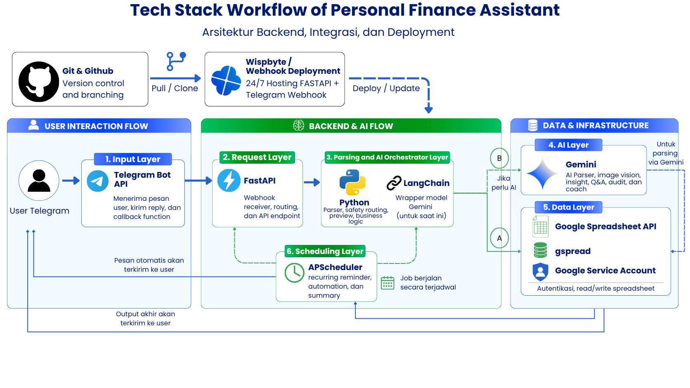
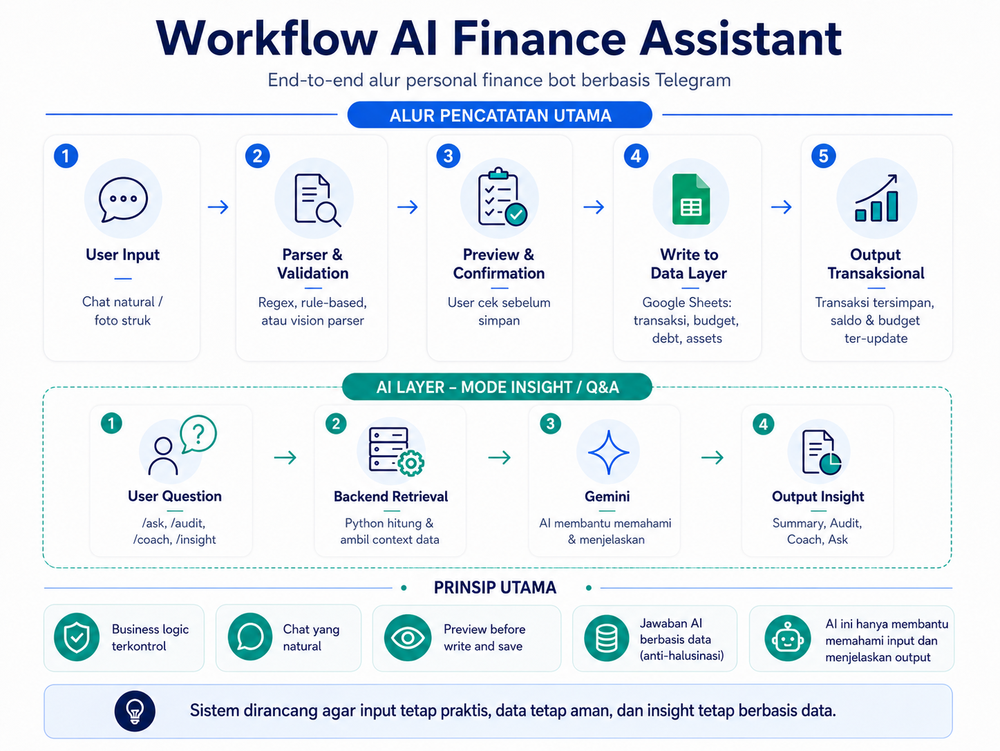

# Personal Finance Bot

Personal Finance Bot adalah Telegram personal finance assistant untuk mencatat, mengelola, dan menganalisis keuangan pribadi langsung dari chat.

Project ini dibuat untuk menyelesaikan masalah pencatatan keuangan harian yang sering terasa ribet, tidak konsisten, dan mudah terlupakan. User cukup mengetik input natural seperti `beli kopi 25k`, `topup gopay 100k dari bsi`, atau `ditalangin Budi bayar makan 100k`, lalu bot akan membantu membuat preview sebelum data disimpan ke Google Sheets.

Secara default, bot berjalan menggunakan **polling mode** supaya mudah dicoba: clone repository, isi `.env`, lalu jalankan `python main.py`. Untuk kebutuhan live 24/7, bot tetap bisa dijalankan dengan polling di Wispbyte atau hosting lain tanpa harus memakai webhook.

Project ini cocok untuk pengguna yang ingin mencatat keuangan lewat chat, orang yang merasa spreadsheet manual terlalu ribet, dan developer yang ingin mempelajari integrasi Telegram Bot, Google Sheets, rule-based parser, automation, dan LLM.

Prinsip utama project ini: **preview before write**, **user confirmation before saving**, **local rules for sensitive finance logic**, dan **Gemini as assistant, not final decision maker**.

## Outline

- [Features](#features)
- [Tech Stack](#tech-stack)
- [System Architecture](#system-architecture)
- [Installation](#installation)
- [Usage](#usage)
- [Project Structure](#project-structure)
- [Limitations and Troubleshooting](#limitations-and-troubleshooting)
- [Advanced Deployment](#advanced-deployment)
- [Author](#author)

## Features

<table style="border-collapse: collapse; width: 100%; border: none;">
  <thead>
    <tr>
      <th align="left" style="border: none; border-bottom: 2px solid #d0d7de; padding: 8px 12px;">Group</th>
      <th align="left" style="border: none; border-bottom: 2px solid #d0d7de; padding: 8px 12px;">Feature</th>
      <th align="left" style="border: none; border-bottom: 2px solid #d0d7de; padding: 8px 12px;">Description</th>
    </tr>
  </thead>
  <tbody>
    <tr>
      <td rowspan="7" align="center" valign="middle" style="border: none; border-bottom: 1px solid #d0d7de; padding: 8px 12px;"><strong>Input</strong></td>
      <td style="border: none; border-bottom: 1px solid #d0d7de; padding: 8px 12px;">Single Input</td>
      <td style="border: none; border-bottom: 1px solid #d0d7de; padding: 8px 12px;">Mencatat satu transaksi dari pesan natural language.</td>
    </tr>
    <tr>
      <td style="border: none; border-bottom: 1px solid #d0d7de; padding: 8px 12px;">Multiple Input</td>
      <td style="border: none; border-bottom: 1px solid #d0d7de; padding: 8px 12px;">Mencatat beberapa transaksi sekaligus dalam satu pesan.</td>
    </tr>
    <tr>
      <td style="border: none; border-bottom: 1px solid #d0d7de; padding: 8px 12px;">Parser Tanggal, Nominal, Rekening, dan Kategori</td>
      <td style="border: none; border-bottom: 1px solid #d0d7de; padding: 8px 12px;">Membaca tanggal relatif, nominal seperti <code>25k</code>/<code>1.5 juta</code>, rekening, dan kategori transaksi.</td>
    </tr>
    <tr>
      <td style="border: none; border-bottom: 1px solid #d0d7de; padding: 8px 12px;">Utang, Piutang, Talangin, dan Ditalangin</td>
      <td style="border: none; border-bottom: 1px solid #d0d7de; padding: 8px 12px;">Mendukung pencatatan utang/piutang personal, termasuk transaksi yang ditalangin atau menalangi orang lain.</td>
    </tr>
    <tr>
      <td style="border: none; border-bottom: 1px solid #d0d7de; padding: 8px 12px;">Split Bill</td>
      <td style="border: none; border-bottom: 1px solid #d0d7de; padding: 8px 12px;">Membagi transaksi ke beberapa orang dan otomatis membuat piutang terkait.</td>
    </tr>
    <tr>
      <td style="border: none; border-bottom: 1px solid #d0d7de; padding: 8px 12px;">Pending Expense</td>
      <td style="border: none; border-bottom: 1px solid #d0d7de; padding: 8px 12px;">Menyimpan transaksi yang belum lengkap untuk dilengkapi kemudian.</td>
    </tr>
    <tr>
      <td style="border: none; border-bottom: 1px solid #d0d7de; padding: 8px 12px;">Input Gambar</td>
      <td style="border: none; border-bottom: 1px solid #d0d7de; padding: 8px 12px;">Membaca struk atau gambar transaksi menggunakan Gemini Vision.</td>
    </tr>
    <tr>
      <td rowspan="2" align="center" valign="middle" style="border: none; border-bottom: 1px solid #d0d7de; padding: 8px 12px;"><strong>Manajemen</strong></td>
      <td style="border: none; border-bottom: 1px solid #d0d7de; padding: 8px 12px;">Debt Void, Debt Edit, Debt Settle</td>
      <td style="border: none; border-bottom: 1px solid #d0d7de; padding: 8px 12px;">Mengelola status utang/piutang, membatalkan debt, mengubah data debt, dan menyelesaikan pembayaran.</td>
    </tr>
    <tr>
      <td style="border: none; border-bottom: 1px solid #d0d7de; padding: 8px 12px;">Delete Txn dan Edit Txn</td>
      <td style="border: none; border-bottom: 1px solid #d0d7de; padding: 8px 12px;">Menghapus atau mengedit transaksi yang sudah tersimpan.</td>
    </tr>
    <tr>
      <td rowspan="6" align="center" valign="middle" style="border: none; border-bottom: 1px solid #d0d7de; padding: 8px 12px;"><strong>Ringkasan</strong></td>
      <td style="border: none; border-bottom: 1px solid #d0d7de; padding: 8px 12px;">Saldo</td>
      <td style="border: none; border-bottom: 1px solid #d0d7de; padding: 8px 12px;">Menampilkan saldo seluruh rekening.</td>
    </tr>
    <tr>
      <td style="border: none; border-bottom: 1px solid #d0d7de; padding: 8px 12px;">Rekening</td>
      <td style="border: none; border-bottom: 1px solid #d0d7de; padding: 8px 12px;">Menampilkan transaksi lengkap dan saldo untuk rekening tertentu.</td>
    </tr>
    <tr>
      <td style="border: none; border-bottom: 1px solid #d0d7de; padding: 8px 12px;">Harian, Mingguan, Bulanan</td>
      <td style="border: none; border-bottom: 1px solid #d0d7de; padding: 8px 12px;">Menampilkan laporan transaksi berdasarkan periode.</td>
    </tr>
    <tr>
      <td style="border: none; border-bottom: 1px solid #d0d7de; padding: 8px 12px;">Cari</td>
      <td style="border: none; border-bottom: 1px solid #d0d7de; padding: 8px 12px;">Mencari transaksi berdasarkan keyword.</td>
    </tr>
    <tr>
      <td style="border: none; border-bottom: 1px solid #d0d7de; padding: 8px 12px;">Last dan Transaksi</td>
      <td style="border: none; border-bottom: 1px solid #d0d7de; padding: 8px 12px;">Melihat transaksi terakhir atau daftar transaksi lengkap.</td>
    </tr>
    <tr>
      <td style="border: none; border-bottom: 1px solid #d0d7de; padding: 8px 12px;">Ringkasan Hutang</td>
      <td style="border: none; border-bottom: 1px solid #d0d7de; padding: 8px 12px;">Menampilkan total utang dan piutang aktif.</td>
    </tr>
    <tr>
      <td rowspan="2" align="center" valign="middle" style="border: none; border-bottom: 1px solid #d0d7de; padding: 8px 12px;"><strong>Budgeting</strong></td>
      <td style="border: none; border-bottom: 1px solid #d0d7de; padding: 8px 12px;">Add Budget</td>
      <td style="border: none; border-bottom: 1px solid #d0d7de; padding: 8px 12px;">Menambahkan budget bulanan per kategori.</td>
    </tr>
    <tr>
      <td style="border: none; border-bottom: 1px solid #d0d7de; padding: 8px 12px;">Budget History</td>
      <td style="border: none; border-bottom: 1px solid #d0d7de; padding: 8px 12px;">Melihat histori budget dan realisasi pengeluaran.</td>
    </tr>
    <tr>
      <td align="center" valign="middle" style="border: none; border-bottom: 1px solid #d0d7de; padding: 8px 12px;"><strong>Recurring Transaction</strong></td>
      <td style="border: none; border-bottom: 1px solid #d0d7de; padding: 8px 12px;">Recurring Transaction</td>
      <td style="border: none; border-bottom: 1px solid #d0d7de; padding: 8px 12px;">Mencatat transaksi berulang seperti wifi, token, langganan, atau iuran.</td>
    </tr>
    <tr>
      <td align="center" valign="middle" style="border: none; border-bottom: 1px solid #d0d7de; padding: 8px 12px;"><strong>Export Data</strong></td>
      <td style="border: none; border-bottom: 1px solid #d0d7de; padding: 8px 12px;">Export Data</td>
      <td style="border: none; border-bottom: 1px solid #d0d7de; padding: 8px 12px;">Export data transaksi untuk backup atau analisis lanjutan.</td>
    </tr>
    <tr>
      <td align="center" valign="middle" style="border: none; border-bottom: 1px solid #d0d7de; padding: 8px 12px;"><strong>Net Worth dan Aset</strong></td>
      <td style="border: none; border-bottom: 1px solid #d0d7de; padding: 8px 12px;">Net Worth dan Aset</td>
      <td style="border: none; border-bottom: 1px solid #d0d7de; padding: 8px 12px;">Melacak aset aktif dan menghitung net worth berdasarkan saldo rekening dan aset.</td>
    </tr>
    <tr>
      <td rowspan="4" align="center" valign="middle" style="border: none; border-bottom: 1px solid #d0d7de; padding: 8px 12px;"><strong>Gemini RAG Finance Insight</strong></td>
      <td style="border: none; border-bottom: 1px solid #d0d7de; padding: 8px 12px;">Coach</td>
      <td style="border: none; border-bottom: 1px solid #d0d7de; padding: 8px 12px;">Memberikan saran keuangan personal berdasarkan data transaksi.</td>
    </tr>
    <tr>
      <td style="border: none; border-bottom: 1px solid #d0d7de; padding: 8px 12px;">Audit</td>
      <td style="border: none; border-bottom: 1px solid #d0d7de; padding: 8px 12px;">Mengecek data quality, anomali, dan potensi kesalahan input.</td>
    </tr>
    <tr>
      <td style="border: none; border-bottom: 1px solid #d0d7de; padding: 8px 12px;">Ask</td>
      <td style="border: none; border-bottom: 1px solid #d0d7de; padding: 8px 12px;">Menjawab pertanyaan natural seperti “bulan ini boros di mana?”.</td>
    </tr>
    <tr>
      <td style="border: none; border-bottom: 1px solid #d0d7de; padding: 8px 12px;">Insight</td>
      <td style="border: none; border-bottom: 1px solid #d0d7de; padding: 8px 12px;">Memberikan insight pola pengeluaran dan prioritas perbaikan.</td>
    </tr>
    <tr>
      <td rowspan="2" align="center" valign="middle" style="border: none; border-bottom: 1px solid #d0d7de; padding: 8px 12px;"><strong>Supporting</strong></td>
      <td style="border: none; border-bottom: 1px solid #d0d7de; padding: 8px 12px;">Typo Handling</td>
      <td style="border: none; border-bottom: 1px solid #d0d7de; padding: 8px 12px;">Membantu menangani typo pada command atau input transaksi.</td>
    </tr>
    <tr>
      <td style="border: none; border-bottom: 1px solid #d0d7de; padding: 8px 12px;">Scheduler</td>
      <td style="border: none; border-bottom: 1px solid #d0d7de; padding: 8px 12px;">Menjalankan job otomatis seperti recurring transaction dan export terjadwal.</td>
    </tr>
  </tbody>
</table>

Contoh penggunaan bot tersedia di bagian [Usage](#usage).

## Tech Stack

<table style="border-collapse: collapse; width: 100%; border: none;">
  <thead>
    <tr>
      <th align="left" style="border: none; border-bottom: 2px solid #d0d7de; padding: 8px 12px;">Layer</th>
      <th align="left" style="border: none; border-bottom: 2px solid #d0d7de; padding: 8px 12px;">Tools</th>
      <th align="left" style="border: none; border-bottom: 2px solid #d0d7de; padding: 8px 12px;">Role in Project</th>
    </tr>
  </thead>
  <tbody>
    <tr>
      <td style="border: none; border-bottom: 1px solid #d0d7de; padding: 8px 12px;"><strong>Chat Interface</strong></td>
      <td style="border: none; border-bottom: 1px solid #d0d7de; padding: 8px 12px;">Telegram Bot API, python-telegram-bot</td>
      <td style="border: none; border-bottom: 1px solid #d0d7de; padding: 8px 12px;">Menerima pesan, command, gambar, dan callback button dari user.</td>
    </tr>
    <tr>
      <td style="border: none; border-bottom: 1px solid #d0d7de; padding: 8px 12px;"><strong>Core Backend</strong></td>
      <td style="border: none; border-bottom: 1px solid #d0d7de; padding: 8px 12px;">Python</td>
      <td style="border: none; border-bottom: 1px solid #d0d7de; padding: 8px 12px;">Menjalankan parser, business logic, parse safety routing, preview flow, debt flow, split bill, pending expense, dan validasi transaksi.</td>
    </tr>
    <tr>
      <td style="border: none; border-bottom: 1px solid #d0d7de; padding: 8px 12px;"><strong>AI Layer</strong></td>
      <td style="border: none; border-bottom: 1px solid #d0d7de; padding: 8px 12px;">Gemini API, LangChain</td>
      <td style="border: none; border-bottom: 1px solid #d0d7de; padding: 8px 12px;">Digunakan untuk parsing gambar, AI finance insight, audit, coach, dan Q&amp;A berbasis data. Provider LLM yang saat ini didukung baru Gemini.</td>
    </tr>
    <tr>
      <td style="border: none; border-bottom: 1px solid #d0d7de; padding: 8px 12px;"><strong>Data Layer</strong></td>
      <td style="border: none; border-bottom: 1px solid #d0d7de; padding: 8px 12px;">Google Sheets API, gspread, Google Service Account</td>
      <td style="border: none; border-bottom: 1px solid #d0d7de; padding: 8px 12px;">Menyimpan transaksi, rekening, budget, debt, asset, pending expense, recurring logs, dan data pendukung lain.</td>
    </tr>
    <tr>
      <td style="border: none; border-bottom: 1px solid #d0d7de; padding: 8px 12px;"><strong>Automation</strong></td>
      <td style="border: none; border-bottom: 1px solid #d0d7de; padding: 8px 12px;">APScheduler</td>
      <td style="border: none; border-bottom: 1px solid #d0d7de; padding: 8px 12px;">Menjalankan recurring reminder, recurring transaction, export, dan scheduled jobs.</td>
    </tr>
    <tr>
      <td style="border: none; border-bottom: 1px solid #d0d7de; padding: 8px 12px;"><strong>Deployment &amp; Versioning</strong></td>
      <td style="border: none; border-bottom: 1px solid #d0d7de; padding: 8px 12px;">Wispbyte, FastAPI, Git, GitHub</td>
      <td style="border: none; border-bottom: 1px solid #d0d7de; padding: 8px 12px;">Git &amp; GitHub untuk version control. Wispbyte dapat dipakai untuk menjalankan polling mode 24/7; FastAPI tersedia sebagai opsi advanced untuk webhook deployment.</td>
    </tr>
  </tbody>
</table>

<p align="center">
  
</p>

Gambar di atas merangkum hubungan antar tools pada project ini. Untuk pemakaian default, jalur utamanya adalah Telegram Bot API → python-telegram-bot → Python business logic → Google Sheets. **FastAPI bukan syarat awal untuk menjalankan bot**, posisinya hanya untuk opsi deployment lanjutan.

## System Architecture

<p align="center">
  
</p>

Sistem ini memiliki dua alur utama. Pertama, **alur pencatatan transaksi**, yaitu input dari Telegram diproses oleh parser, dicek dengan parse safety routing, divalidasi melalui preview, lalu disimpan ke Google Sheets setelah user melakukan konfirmasi. Kedua, **alur AI insight**, yaitu user dapat bertanya melalui `/ask`, `/audit`, `/coach`, atau `/insight`, lalu backend mengambil konteks data yang relevan sebelum Gemini membantu menyusun penjelasan.

Secara runtime, mode default project ini adalah **polling**. Artinya, proses Python mengambil update dari Telegram Bot API secara berkala selama aplikasi berjalan. Pendekatan ini lebih mudah untuk local setup dan tetap bisa dipakai untuk live 24/7 di Wispbyte atau hosting lain selama proses `python main.py` terus berjalan.

AI tidak langsung mengambil keputusan finansial sendiri. Business logic tetap dikontrol oleh backend, sedangkan Gemini digunakan untuk membantu memahami input, membaca gambar, dan menjelaskan insight berdasarkan data yang sudah tersedia.

## Installation

### 1. Clone dan install dependency

```bash
git clone https://github.com/username/denan-finance-bot.git
cd denan-finance-bot
python -m venv .venv
```

Aktifkan virtual environment.

Windows:

```bash
.venv\Scripts\activate
```

Mac/Linux:

```bash
source .venv/bin/activate
```

Install dependency:

```bash
pip install -r requirements.txt
```

### 2. Buat file `.env`

Copy `.env.example` menjadi `.env`.

```bash
cp .env.example .env
```

Jika menggunakan Windows Command Prompt:

```cmd
copy .env.example .env
```

Isi konfigurasi minimal berikut:

```env
BOT_MODE=polling

TELEGRAM_BOT_TOKEN=your_bot_token_here
ALLOWED_USER_ID=your_telegram_user_id_here

GOOGLE_SHEET_ID=your_spreadsheet_id_here
GOOGLE_SERVICE_ACCOUNT_JSON=service_account.json

GEMINI_API_KEY=your_gemini_api_key_here
GEMINI_MODEL=gemini-3.1-flash-lite
GEMINI_TEXT_MODEL=gemini-3.1-flash-lite
GEMINI_INTENT_MODEL=gemini-3.1-flash-lite
GEMINI_IMAGE_MODEL=gemini-3.1-flash-lite
GEMINI_INSIGHT_MODEL=gemini-3.1-flash-lite
```

Keterangan env utama:

| Variable | Description |
|---|---|
| `BOT_MODE` | Gunakan `polling` untuk setup lokal dan setup sederhana. |
| `TELEGRAM_BOT_TOKEN` | Token bot dari BotFather. |
| `ALLOWED_USER_ID` | Telegram user ID yang diizinkan memakai bot. |
| `GOOGLE_SHEET_ID` | ID spreadsheet Google Sheets. |
| `GOOGLE_SERVICE_ACCOUNT_JSON` | Path file service account JSON, default `service_account.json`. |
| `GEMINI_API_KEY` | API key Gemini. |
| `GEMINI_MODEL` | Default Gemini model. |

### 3. Setup Telegram

1. Buka Telegram dan cari `@BotFather`.
2. Buat bot baru, lalu copy token ke `TELEGRAM_BOT_TOKEN`.
3. Ambil Telegram user ID kamu, lalu isi ke `ALLOWED_USER_ID`.

`ALLOWED_USER_ID` disarankan tetap dipakai karena bot ini berisi data keuangan pribadi.

### 4. Setup Google Sheets

Buat satu file Google Sheets kosong, lalu copy ID spreadsheet dari URL.

```text
https://docs.google.com/spreadsheets/d/SPREADSHEET_ID/edit
```

Masukkan ID tersebut ke `.env`:

```env
GOOGLE_SHEET_ID=SPREADSHEET_ID
```

Lalu siapkan service account:

1. Buat service account di Google Cloud.
2. Download file JSON credential.
3. Rename menjadi `service_account.json`.
4. Letakkan file tersebut di root project.
5. Share Google Sheets ke email `client_email` di file service account dengan akses **Editor**.

Contoh struktur file tersedia di `service_account.example.json`. Jangan commit file credential asli ke GitHub.

Bot akan otomatis mengecek struktur Google Sheets saat startup. Jika spreadsheet masih kosong, tab belum ada, atau header sheet belum lengkap, struktur dasar akan dibuat otomatis.

Tab yang disiapkan otomatis:

```text
transactions
accounts
budgets
debts
debt_payments
categories
monthly_summary
recurring_rules
recurring_logs
assets
pending_expenses
net_worth_snapshots
```

Sheet `accounts` juga akan diberi rekening awal dengan saldo 0:

```text
Cash, BRI, BSI, BCA, DANA, GoPay, Seabank
```

Saldo awal bisa diedit manual langsung di Google Sheets setelah struktur dibuat.

### 5. Setup Gemini

`GEMINI_API_KEY` digunakan untuk fitur AI parser, image parser, audit, coach, dan finance insight.

Cara setup:

1. Buka Google AI Studio.
2. Buat API key Gemini.
3. Copy API key.
4. Masukkan ke `.env`.

Catatan:

- Project ini saat ini baru mendukung Gemini sebagai provider LLM.
- Nama model Gemini bisa diganti melalui `.env`.
- Provider lain seperti Llama, OpenAI, Groq, Ollama, atau OpenRouter belum didukung out of the box dan membutuhkan adapter/client baru.

### 6. Cek setup dan jalankan bot

Jalankan setup check:

```bash
python scripts/setup_check.py
```

Script ini mengecek file `.env`, env wajib, format `ALLOWED_USER_ID`, keberadaan `service_account.json`, package Python utama, akses Google Sheets, dan auto-setup schema jika credential sudah benar.

Untuk diagnostic yang lebih lengkap:

```bash
python scripts/debug_check.py
```

Jalankan bot secara lokal:

```bash
python main.py
```

Selama proses Python masih berjalan, bot akan aktif menerima pesan dari Telegram.


### 7. Deploy 24/7 dengan Wispbyte (Opsional)

> Catatan: bagian ini opsional. Kalau hanya ingin mencoba bot secara lokal, cukup berhenti di langkah 6. Gunakan bagian ini jika ingin bot tetap hidup 24/7 tanpa perlu menyalakan laptop terus-menerus.

Kalau ingin bot tetap aktif 24/7, kamu bisa menjalankan mode polling yang sama di Wispbyte atau hosting lain. Ini masih termasuk setup sederhana karena tidak membutuhkan webhook URL, webhook secret, public domain, atau konfigurasi FastAPI.

Ada dua cara mudah untuk deploy ke Wispbyte:

```text
Opsi A: GitHub Repository
Project di-push ke GitHub → Wispbyte pull dari repo → app jalan

Opsi B: Upload Manual
Project di-upload/import langsung ke Wispbyte → app jalan
```

Keduanya tetap memakai start command yang sama:

```bash
python main.py
```

##### Opsi A: Deploy Wispbyte melalui GitHub

Opsi ini cocok kalau project kamu sudah rapi di GitHub dan kamu ingin update deployment dengan cara push commit.

Alur sederhananya:

```text
GitHub Repository
→ Wispbyte App
→ Install dependencies
→ Run python main.py
→ Bot aktif 24/7 menggunakan polling
```

Langkah setup:

1. Push project ini ke GitHub.
2. Buat app/project baru di Wispbyte.
3. Hubungkan app tersebut ke repository GitHub project ini.
4. Pilih runtime Python sesuai versi yang kamu gunakan secara lokal.
5. Isi environment variables yang sama seperti `.env.example`.
6. Pastikan file `service_account.json` tersedia di environment deployment.
7. Isi install command:

```bash
pip install -r requirements.txt
```

8. Isi start command:

```bash
python main.py
```

##### Opsi B: Deploy Wispbyte dengan upload manual

Opsi ini cocok kalau kamu ingin cara paling cepat tanpa menghubungkan GitHub terlebih dahulu.

Alur sederhananya:

```text
Project folder / ZIP
→ Upload atau import manual ke Wispbyte
→ Install dependencies
→ Run python main.py
→ Bot aktif 24/7 menggunakan polling
```

Langkah setup:

1. Siapkan folder project di lokal.
2. Pastikan file yang di-upload berisi kode project dan `requirements.txt`.
3. Jangan upload file sensitif ke tempat publik.
4. Upload folder atau ZIP project ke Wispbyte.
5. Isi environment variables yang sama seperti `.env.example`.
6. Pastikan `service_account.json` tersedia di environment deployment atau upload melalui fitur file/secret yang disediakan.
7. Isi install command:

```bash
pip install -r requirements.txt
```

8. Isi start command:

```bash
python main.py
```

Kalau kamu memakai upload manual, setiap ada update kode kamu perlu upload ulang file terbaru. Kalau memakai GitHub, update biasanya lebih enak karena cukup push commit lalu redeploy.

Environment variable utama yang perlu diisi di Wispbyte:

```env
BOT_MODE=polling

TELEGRAM_BOT_TOKEN=your_bot_token_here
ALLOWED_USER_ID=your_telegram_user_id_here

GOOGLE_SHEET_ID=your_spreadsheet_id_here
GOOGLE_SERVICE_ACCOUNT_JSON=service_account.json

GEMINI_API_KEY=your_gemini_api_key_here
GEMINI_MODEL=gemini-3.1-flash-lite
GEMINI_TEXT_MODEL=gemini-3.1-flash-lite
GEMINI_INTENT_MODEL=gemini-3.1-flash-lite
GEMINI_IMAGE_MODEL=gemini-3.1-flash-lite
GEMINI_INSIGHT_MODEL=gemini-3.1-flash-lite
```

Catatan penting untuk credential Google:

- Jangan commit `service_account.json` asli ke GitHub.
- Jika memakai GitHub deployment, simpan credential melalui fitur secret/file manager dari Wispbyte jika tersedia.
- Jika memakai upload manual, `service_account.json` boleh disediakan di environment Wispbyte, tetapi tetap jangan dibagikan ke repository publik.
- Jika platform deployment meminta path file credential, pastikan nilai `GOOGLE_SERVICE_ACCOUNT_JSON` sesuai dengan lokasi file tersebut.
- Google Sheets tetap harus di-share ke email `client_email` dari service account dengan akses **Editor**.

Catatan operasional:

- Jangan menjalankan bot dengan token yang sama di dua tempat sekaligus, misalnya laptop dan Wispbyte bersamaan.
- Jika sebelumnya bot pernah memakai webhook, mode polling akan menghapus webhook lama saat startup agar update Telegram bisa diterima melalui polling.
- Selama proses `python main.py` tetap hidup di Wispbyte, bot akan terus mengambil update dari Telegram Bot API.

## Usage

### Example Inputs

| Input | Expected Behavior |
|---|---|
| `beli kopi 20k dari Cash` | Expense preview |
| `bayar listrik 150k dari BRI` | Expense preview |
| `gaji masuk 8jt ke BCA` | Income preview |
| `BCA ke DANA 200k` | Transfer preview |
| `tf gopay 100k dari BRI` | Transfer preview |
| `Budi minjem 50k` | Debt preview |
| `Budi bayar hutang 100k Cash` | Debt payment flow |
| `galon 24k dibagi 4` | Split bill flow |
| `makanan ikan 10k` | Warning preview |
| `Budi bayar makan 100k` | Clarification prompt |
| `/ask bulan ini boros di mana?` | AI finance Q&A berbasis data sheet |

Di dalam bot, user juga bisa mengetik `/examples` untuk melihat contoh input cepat.

### Input Transaksi Harian

```text
beli kopi 25k
beli nasi padang 17k pakai cash
gaji masuk 8 juta ke bsi
topup gopay 100k dari bsi
transfer 250k dari bsi ke dana
```

### Input Banyak Transaksi

```text
beli nasi 17k
beli kopi 20k
beli bensin 40k pakai cash
```

### Input dengan Tanggal

```text
beli kopi 25k kemarin
beli bensin 40k tanggal 12
beli token 100k 2026-06-15
```

### Utang dan Piutang

```text
minjem uang ke Budi 100k
Budi bayar hutang 50k
pinjemin Raka 75k
Raka bayar piutang 25k
```

### Talangin dan Ditalangin

```text
talangin Budi beli makan 100k
ditalangin Raka bayar parkir 20k
```

### Split Bill

```text
beli galon 24k dibagi 4 sama Budi Raka Dimas
makan 120k split sama Budi Raka
```

### Pending Expense

```text
pending beli token 100k
```

### Budget

```text
budget makan 1.5 juta
budget transport 300k
/budget
/budget_history
```

### Ringkasan dan Laporan

```text
/saldo
/rekening Cash
/harian
/mingguan
/bulanan
/transaksi
/last
/cari kopi
/ringkasan_hutang
```

### Debt Management

```text
/hutang
/hutang Budi
/debt_void Budi
/debt_edit
/debt_settle
```

### Net Worth dan Aset

```text
/assets
/asset_add
/asset_update
/networth
```

### Export Data

```text
/export
```

### AI Finance Insight

```text
/coach
/audit
/insight
/ask bulan ini boros di mana?
/ask pengeluaran terbesar bulan ini apa?
```

## Project Structure

```text
.
├── app/
│   ├── api/
│   │   └── webhook.py
│   ├── bot/
│   │   ├── application.py
│   │   ├── handlers.py
│   │   ├── keyboards.py
│   │   └── handler_parts/
│   │       ├── callback_handler.py
│   │       ├── command_handlers.py
│   │       ├── command_router.py
│   │       ├── common_imports.py
│   │       ├── core.py
│   │       ├── health_recurring_export.py
│   │       ├── message_handlers.py
│   │       ├── networth_assets.py
│   │       └── transaction_flow.py
│   ├── nlp/
│   │   ├── gemini_finance_insight.py
│   │   ├── gemini_image_parser.py
│   │   ├── gemini_intent_router.py
│   │   ├── gemini_langchain_client.py
│   │   ├── gemini_parser.py
│   │   ├── normalizer.py
│   │   ├── parse_safety.py
│   │   └── regex_parser.py
│   ├── scheduler/
│   │   └── jobs.py
│   ├── services/
│   │   ├── budget_service.py
│   │   ├── debt_service.py
│   │   ├── finance_insight_service.py
│   │   ├── net_worth_service.py
│   │   ├── pending_expense_service.py
│   │   ├── recurring_service.py
│   │   ├── report_service.py
│   │   └── transaction_service.py
│   ├── sheets/
│   │   └── client.py
│   └── config.py
├── assets/
│   ├── workflow-ai-finance-assistant.png
│   └── tech-stack-workflow-personal-finance-assistant.png
├── scripts/
│   ├── setup_check.py
│   └── debug_check.py
├── .env.example
├── .env.webhook.example
├── service_account.example.json
├── .gitignore
├── main.py
├── README.md
└── requirements.txt
```

Catatan struktur:

- `main.py` adalah runtime entrypoint. Default-nya menjalankan polling mode.
- `app/bot/application.py` berisi builder Telegram application dan registrasi handler agar tidak duplikatif antara mode lokal dan deployment.
- `app/bot/handler_parts/` memecah handler besar menjadi modul yang lebih mudah dirawat.
- `app/nlp/parse_safety.py` mengatur risk flag dan routing preview/clarification untuk hasil parsing yang rawan salah.
- `scripts/setup_check.py` ditujukan untuk onboarding user baru.
- `scripts/debug_check.py` ditujukan untuk diagnostic developer yang lebih lengkap.

## Limitations and Troubleshooting

### Limitations

1. **LLM provider saat ini baru Gemini**  
   Model Gemini bisa diganti melalui `.env`, tetapi provider selain Gemini seperti Llama, OpenAI, Groq, Ollama, atau OpenRouter belum didukung tanpa penambahan adapter/client baru.

2. **Google Sheets bukan database transaksional penuh**  
   Project ini menggunakan Google Sheets sebagai data store utama. Sudah ada retry dan rollback handling, tetapi tetap tidak sekuat database seperti PostgreSQL untuk transaksi berskala besar atau multi-user berat.

3. **Bot didesain untuk personal use**  
   Bot ini belum dirancang sebagai aplikasi SaaS multi-user penuh. `ALLOWED_USER_ID` tetap disarankan agar data finance pribadi tidak terbuka untuk orang lain.

4. **Parsing natural language tetap bisa ambigu**  
   Project sudah memakai parse safety routing, warning preview, dan clarification flow, tetapi input yang terlalu ambigu tetap membutuhkan koreksi user.

5. **AI insight bergantung pada kualitas data**  
   Insight dari Gemini akan lebih akurat jika kategori, rekening, tanggal, dan tipe transaksi sudah rapi.

### Troubleshooting

**Bot tidak merespons**

- Pastikan `python main.py` masih berjalan.
- Pastikan `TELEGRAM_BOT_TOKEN` benar.
- Pastikan kamu mengirim pesan dari Telegram user ID yang sama dengan `ALLOWED_USER_ID`.
- Jalankan `python scripts/setup_check.py` untuk mengecek setup dasar.

**Google Sheets error**

- Pastikan `GOOGLE_SHEET_ID` benar.
- Pastikan file `service_account.json` ada di root project.
- Pastikan Google Sheets sudah di-share ke email `client_email` service account dengan akses Editor.
- Jika spreadsheet kosong, biarkan bot membuat tab dan header otomatis saat startup.

**Gemini error**

- Pastikan `GEMINI_API_KEY` benar.
- Pastikan model Gemini yang ditulis di `.env` tersedia untuk API key kamu.
- Ingat bahwa provider LLM yang saat ini didukung baru Gemini.

**Package import error**

Jalankan ulang instalasi dependency:

```bash
pip install -r requirements.txt
```

## Advanced Deployment

Bagian ini opsional. Untuk mencoba bot secara lokal atau menjalankannya 24/7 di Wispbyte, cukup gunakan polling mode pada bagian Installation.

### Optional FastAPI webhook mode

FastAPI tetap tersedia jika kamu ingin memakai webhook deployment. Mode ini bersifat advanced dan tidak wajib untuk menjalankan bot.

Gunakan `.env.webhook.example` sebagai referensi:

```env
BOT_MODE=webhook
APP_PORT=8000

TELEGRAM_BOT_TOKEN=your_bot_token_here
TELEGRAM_WEBHOOK_SECRET=your_random_secret_here
ALLOWED_USER_ID=your_telegram_user_id_here

WEBHOOK_URL=https://your-domain.com

GOOGLE_SHEET_ID=your_spreadsheet_id_here
GOOGLE_SERVICE_ACCOUNT_JSON=service_account.json

GEMINI_API_KEY=your_gemini_api_key_here
GEMINI_MODEL=gemini-3.1-flash-lite
```

Run webhook mode:

```bash
BOT_MODE=webhook python main.py
```

Atau pada platform yang menjalankan ASGI server:

```bash
uvicorn main:app --host 0.0.0.0 --port 8000
```

## Author

**Denanda Aufadlan Tsaqif**

- LinkedIn: `https://www.linkedin.com/in/denandaa`
- GitHub: `https://github.com/denann`
