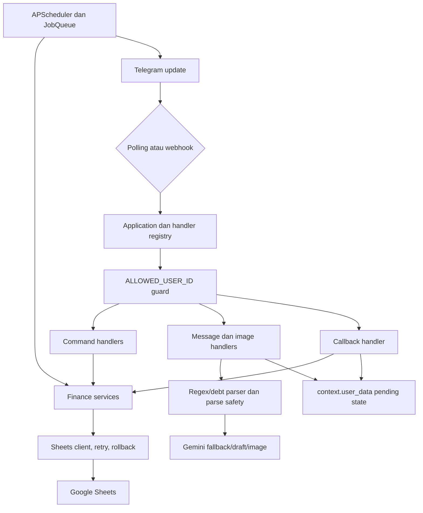

# System Map

## Runtime dan entry point

- Bahasa: Python.
- Telegram framework: `python-telegram-bot`.
- Entry point: `main.py`.
- Mode: polling default atau FastAPI webhook.
- Data store: satu Google Spreadsheet melalui `gspread`.
- AI: Gemini melalui `langchain-google-genai`.
- Scheduling: APScheduler untuk reminder/ringkasan; PTB JobQueue untuk export harian.
- Test: tidak ada suite formal yang dilacak; tersedia script diagnostic/regression.

## Component responsibility

| Komponen | Tanggung jawab aktual | Catatan batas |
| :--- | :--- | :--- |
| `main.py` | Build app saat import, validasi runtime, schema startup, polling/webhook, health endpoints, scheduler lifecycle | `/test-sheets` juga menjalankan schema mutation |
| `app/bot/application.py` | Registrasi command/message/callback, wrapper `sheets_transaction`, JobQueue export | Tidak memakai persistence atau operation-id middleware |
| `handler_parts/message_handlers.py` | Routing natural input, image, multi-input, AI intent, edit/delete | `message_handler` 460 baris |
| `handler_parts/callback_handler.py` | Seluruh callback dan mayoritas final writes | Satu fungsi 3.561 baris; hotspot utama |
| `handler_parts/transaction_flow.py` | Preview, keyboard, split bill, mixed input, edit preview | Banyak business rule juga berada di handler layer |
| `app/nlp/*` | Amount/date/debt parsing, parse safety, Gemini draft/image/intent | Gemini call sinkron; fallback dapat berantai |
| `app/services/*` | Transaction, debt, budget, recurring, pending, asset, report, AI context | Beberapa fungsi menangkap error dan mengembalikan status setelah write parsial |
| `app/sheets/client.py` | Schema, client cache, full-sheet reads, write retry, rollback best-effort | Semua I/O sinkron; retry tidak membedakan idempotent/non-idempotent |
| `app/scheduler/jobs.py` | Reminder recurring, daily/weekly/monthly summary, debt reminder | Zona scheduler Jakarta, tetapi business date memakai `datetime.now()` naive |
| `scripts/*` | Setup, debug, parser/command tester | Setup/schema check dapat menulis; tester offline saat ini gagal import |

## Aliran transaksi normal

1. Telegram update masuk melalui polling atau `POST /webhook`.
2. Handler melakukan authorization terhadap `ALLOWED_USER_ID`.
3. Natural text melewati state/wizard consumers, asset/social/pending/debt/AI routing, lalu parser transaksi.
4. Regex parser dicoba; bila gagal, Gemini parser dipanggil.
5. Parse safety menentukan normal preview, warning, Gemini draft, atau clarification.
6. Candidate disimpan ke satu key seperti `context.user_data["pending_parsed"]`.
7. Preview menampilkan keyboard generik seperti `confirm:pending`.
8. Callback membaca key pending saat ini, memanggil service, lalu service menulis row dan saldo lewat Sheets client.
9. Handler mengedit pesan hasil dan menghapus pending state.

Titik lemah ada pada langkah 6–8: callback tidak terikat ke preview tertentu (**F-001**) dan write outcome dapat berbeda dengan status yang dikembalikan (**F-002/F-003**).

## Aliran debt/split bill

Debt parser berjalan sebelum parser transaksi normal. Setelah preview, callback biasanya:

1. membuat/mengubah row `debts` atau `debt_payments`;
2. membangun cashflow transaction;
3. menyimpan transaction dan mengubah saldo;
4. menautkan `hutang_id` pada transaction.

Urutan ini melibatkan beberapa sheet. Sebagian failure dikonversi menjadi result dict dan tidak keluar sebagai exception, sehingga wrapper rollback tidak selalu aktif (**F-003**).

## Aliran Gemini

| Jalur | Trigger | Model env | Validasi output |
| :--- | :--- | :--- | :--- |
| Text transaction | Regex tidak menghasilkan transaksi atau parse-safety draft | `GEMINI_TEXT_MODEL` | JSON parse + required fields + preview |
| Intent router | Input pending dengan keyword command-like | `GEMINI_INTENT_MODEL` | Allowed intent + confidence; destructive route menuju preview |
| Receipt/image | Photo/document image | `GEMINI_IMAGE_MODEL` | JSON normalization + receipt review/preview |
| Insight | `/ask`, `/audit`, `/coach`, `/insight`, `/bulanan` | `GEMINI_INSIGHT_MODEL` | Text grounding prompt; deterministic fallback |
| Category aliases | Wizard add/edit category | default text model | JSON/list normalization + preview |

Tidak ada timeout eksplisit, output token cap, usage logging, latency logging, prompt version, atau request correlation ID (**F-012**).

## State ownership

- `context.user_data`: pending previews, wizard state, `last_txn_map`, `last_debt_map`.
- Module globals: cached Sheets client/spreadsheet/worksheets, scheduler, Telegram application, webhook app reference.
- Google Sheets: persistent finance data.
- Tidak ada PTB persistence: pending state dan numeric maps hilang saat restart (**F-017**).

## Hotspot kompleksitas

| Symbol | Span terukur | Dampak |
| :--- | ---: | :--- |
| `callback_handler` | 3.561 baris | Routing, state, UX, dan writes bercampur |
| `parse_debt_input` | 630 baris | Banyak business rule regex dalam satu fungsi |
| `message_handler` | 460 baris | Urutan routing sangat sensitif |
| `handle_gemini_intent` | 372 baris | AI routing dan Telegram presentation bercampur |
| `add_payment_by_person` | 309 baris | Allocation, overpayment, write, rollback bercampur |

Static import analysis juga menemukan cycle antara `transaction_service` dan `debt_service`, serta `common_imports.py` mengimpor 17 modul internal.

