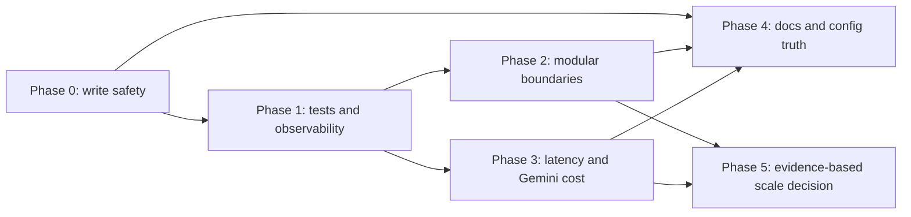

# Improvement Roadmap

Tanggal audit: 2026-07-10  
Status: proposal audit; **belum ada implementasi**

## Prinsip sequencing

Fase disusun berdasarkan data safety dan kemampuan verifikasi, bukan kalender. Tidak ada estimasi hari/minggu karena kapasitas owner dan staging environment belum diketahui. Setiap fase harus menjadi change set terpisah, reviewable, dan dapat dihentikan sebelum fase berikutnya.

## Phase 0 — Stop unsafe or ambiguous writes

- **Goal:** tutup jalur yang dapat menyimpan action salah, duplicate, partial, false-success, atau tanpa confirmation.
- **Reason:** ini adalah risiko finansial langsung.
- **Findings:** F-001, F-002, F-003, F-004, F-005, F-006, F-007, F-008.
- **Scope:** immutable action/callback ID; consume/expiry; atomic error propagation; recurring exactly-once guard; retry reconciliation; invalid-date clarification; preview untuk direct-write commands; secure/remove mutable diagnostic route.
- **Non-goals:** refactor monolith, database migration, UI redesign luas, multi-user.
- **Protected contracts:** callback format, command steps, Sheets schema/idempotency column, health/test route. **REQUIRES EXPLICIT OWNER APPROVAL.**
- **Modules likely affected:** transaction flow/handlers, callback handler, transaction/debt/recurring/asset services, Sheets client, application/main routes.
- **Dependencies:** owner decision on legacy callback handling, staging sheet, action store/schema approach.
- **Acceptance criteria:** preview A hanya dapat menulis A sekali; all side effects succeed or overall failure/reconciliation; ambiguous retry tidak menduplikasi; invalid date tidak menjadi today; every mutation gets final preview; no unauthenticated schema mutation route.
- **Tests:** callback replay/stale; failure injection at every write; retry-after-commit; recurring double-click/scheduler race; command confirmation matrix; route auth/read-only test.
- **Change risk:** High, karena menyentuh protected behavior.
- **Rollback:** feature flags/compat parser for new callbacks, retain old callback only as safe-expired response; deploy with mutation journal; code rollback plus explicit data reconciliation.
- **Effort:** L–XL.
- **Owner decisions:** action storage, callback migration, idempotency schema, commands requiring an extra confirmation, production diagnostic policy.

## Phase 1 — Build verification and operational safety net

- **Goal:** buat behavior critical dapat dibuktikan dan incident dapat ditelusuri.
- **Reason:** perubahan berikutnya terlalu berisiko tanpa deterministic tests dan observability.
- **Findings:** F-012, F-014, F-017, F-018, F-020, F-023.
- **Scope:** tracked tests; fake repositories/APIs; staging smoke policy; structured redacted events; metrics; correlation IDs; liveness/readiness; supported Python/dependency lock; explicit timezone.
- **Non-goals:** optimize all queries, rewrite handlers, production multi-user.
- **Protected contracts:** health response/status, logging retention, timezone meaning, dependency/runtime support.
- **Modules likely affected:** test config, config, main/application, clock/scheduler helpers, logging wrappers, dependency manifest.
- **Dependencies:** owner SLO, privacy/log policy, staging credentials, CI environment.
- **Acceptance criteria:** clean install can run suite; F-001–F-007 tests deterministic; operator distinguishes alive/ready; logs contain no raw secrets/finance text; scheduler/time tests independent of host TZ.
- **Tests:** unit/service/handler suite, clean-environment install, readiness dependency-down, log redaction, UTC/Jakarta frozen time.
- **Change risk:** Medium.
- **Rollback:** metrics/log additions removable; keep old health field while adding versioned readiness; pin rollback artifact.
- **Effort:** L.
- **Owner decisions:** CI provider, supported Python, telemetry destination/retention, health compatibility.

## Phase 2 — Clarify domain and module boundaries

- **Goal:** reduce monolith coupling and make finance rules testable without external systems.
- **Reason:** large handlers, wildcard imports, cycles, duplicates, and dead features increase regression probability.
- **Findings:** F-015, F-016, F-021, F-022.
- **Scope:** typed application results/errors; thin handler/use-case/repository boundaries; break import cycle; canonical utility/tester; item-level bulk clarification; liability owner decision.
- **Non-goals:** microservices, framework replacement, full backend migration.
- **Protected contracts:** public commands/copy, bulk flow semantics, liability command availability.
- **Modules likely affected:** callback/command/message handlers, transaction/debt services, common imports/core utilities, tester scripts, liability compatibility code.
- **Dependencies:** Phase 1 tests; owner decisions on bulk and liability.
- **Acceptance criteria:** dependency direction documented/checked; no transaction↔debt service cycle; one canonical utility; valid bulk items survive another item's clarification; registry/docs/tester agree on liability.
- **Tests:** module import smoke, contract tests, bulk mixed cases, command registry snapshots, CLI compatibility.
- **Change risk:** Medium–High.
- **Rollback:** extract one use case at a time with adapter preserving old entry point; revert per feature.
- **Effort:** XL.
- **Owner decisions:** bulk UX, liability removal/restoration, acceptable compatibility wrappers.

## Phase 3 — Control latency and Gemini cost

- **Goal:** bound response latency, API calls, rows transferred, and AI spend.
- **Reason:** synchronous I/O and repeated full data reads/calls will degrade with history and features.
- **Findings:** F-009, F-010, F-011, F-012, F-013.
- **Scope:** metrics-informed executor/async boundary; timeouts/concurrency; remove full rewrite-on-save if safe; query/cache/aggregation strategy; Gemini typed boundary, prompt/model version, call/token limits, redaction.
- **Non-goals:** premature database/microservices; changing AI answer semantics without evaluation.
- **Protected contracts:** sort/order visible in Sheets, report freshness, Gemini model/prompt/output, privacy policy.
- **Modules likely affected:** Sheets/client and services, reports/search/export, Gemini parser/router/insight, image flow.
- **Dependencies:** Phase 1 telemetry and synthetic benchmark; SLO and budget.
- **Acceptance criteria:** measured p95 within owner SLO; bounded external call count; no event-loop blocking sleep; model/call/token telemetry; report correctness fixtures unchanged.
- **Tests:** 100/1k/10k synthetic benchmark, concurrency, timeout/cancellation, Gemini call-count/golden evaluation, sort/report regression.
- **Change risk:** Medium–High.
- **Rollback:** per-feature flags/cache bypass; keep old query path until parity proven; pin prior model/prompt.
- **Effort:** L–XL.
- **Owner decisions:** latency SLO, cost budget, freshness, allowed AI context, visible sheet ordering.

## Phase 4 — Synchronize configuration and documentation

- **Goal:** membuat checkout, operation, dan user contract reproducible dan tidak menyesatkan.
- **Reason:** docs/default/env drift menghambat setup dan memperkuat klaim behavior yang belum benar.
- **Findings:** F-019, F-023; documentation consequences of F-007, F-008, F-012, F-020, F-022.
- **Scope:** complete env schema/examples; deployment/testing/runbook; command/help registry checks; architecture/data/safety docs; canonical function inventory; regenerate manual PDF.
- **Non-goals:** mendokumentasikan behavior sebelum implemented/tested; menambah fitur.
- **Protected contracts:** `/start`, `/help`, command examples, public configuration names/defaults.
- **Modules/docs likely affected:** root and app READMEs, docs 01–10/help manual, examples, generated PDF, config registry.
- **Dependencies:** Phase 0–3 decisions and verified behavior.
- **Acceptance criteria:** every env lookup documented; commands registry/help/tester match; no duplicate function sections; safety statements pass contract tests; links/PDF render verified.
- **Tests:** docs link/lint, command snapshot, config schema coverage, clean setup walkthrough, PDF visual QA.
- **Change risk:** Low–Medium, but misleading docs are a contract risk.
- **Rollback:** source docs versioned; regenerate artifacts deterministically; revert doc group independently.
- **Effort:** M–L.
- **Owner decisions:** source of truth, supported setup/deployment paths, public wording.

## Phase 5 — Decide scale and persistence based on evidence

- **Goal:** choose whether Sheets/single-user architecture remains sufficient.
- **Reason:** F-024 is not a current bug; migration should respond to measured limits.
- **Findings:** F-024 plus unresolved scale portions of F-009, F-011, F-018, F-020.
- **Scope:** review metrics; repository contract; optional spreadsheet-per-user, database transaction store, distributed scheduler/queue, tenant isolation and migration plan.
- **Non-goals:** automatic rewrite solely for modernization.
- **Protected contracts:** schema/data history, authorization, export/delete, timezone, scheduler semantics, report totals.
- **Modules likely affected:** persistence adapters, domain repositories, config/auth, scheduler, migration/reconciliation tooling.
- **Dependencies:** stable contracts/tests/metrics from prior phases; product decision to add users/instances.
- **Acceptance criteria:** architecture decision record cites measured triggers; if migrating, parity/reconciliation and rollback rehearsed; cross-tenant tests pass before second user.
- **Tests:** repository contract suite across adapters, migration dry run, row/count/balance reconciliation, tenant isolation, multi-instance job claim.
- **Change risk:** Very High.
- **Rollback:** dual-read or controlled cutover, immutable backup/export, reversible mapping, explicit reconciliation; never destructive in-place migration first.
- **Effort:** XL.
- **Owner decisions:** product scope, data store, tenant model, retention/privacy, operational budget.

## Dependency graph

## Approval gate sebelum implementasi

Owner perlu menjawab minimum: callback migration, idempotency/action storage, direct-write command UX, diagnostic endpoint policy, supported Python/dependency strategy, logging/privacy/SLO, Gemini model/budget, liability status, dan apakah produk tetap single-user/single-process. Sampai keputusan eksplisit diberikan, roadmap ini hanya rekomendasi.
